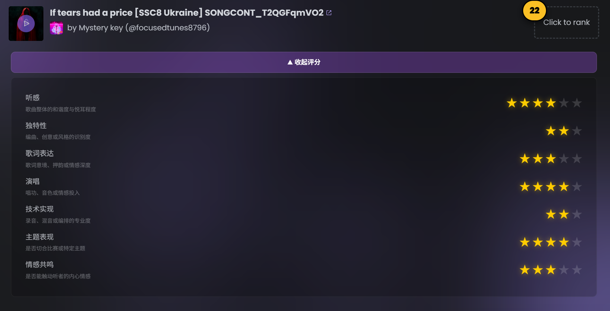
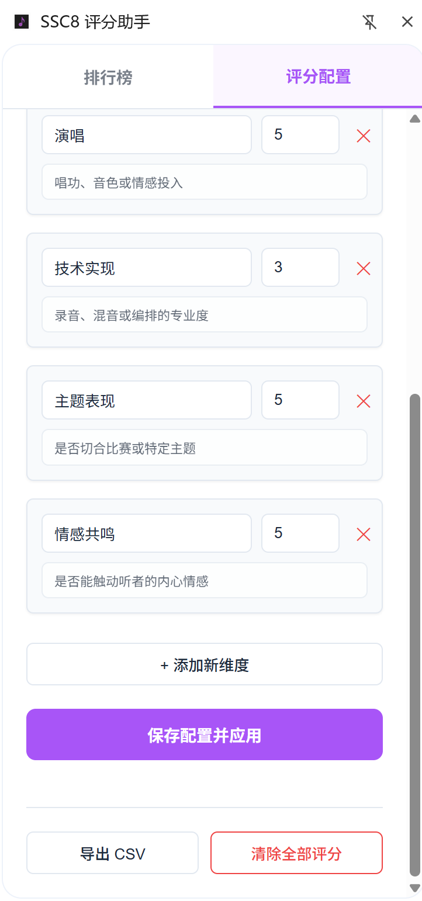

# SSC8 Rating Assistant | SSC8 评分助手

> **Professional multi-dimensional song rating tool for [songcontest.ai](https://songcontest.ai)**
> **为 songcontest.ai 打造的专业级多维度歌曲评分与管理助手**


---

## 🌟 核心理念 | Core Philosophy

**“简化是最高形式的复杂。”**
本插件旨在为 [SSC8](https://songcontest.ai) 选手的审美评价提供一套科学、量化且无侵入的工具集。我们不仅记录分数，更在记录每一位评委的“评审哲学”。

---

## ✨ 主要功能 | Key Features

### 1. 智能 UI 注入 | Smart Injection
- **无感集成**：通过 `MutationObserver` 技术，自动识别页面动态加载的歌曲卡片。
- **锚点算法**：精准定位“Click to rank”按钮，确保在复杂的 Radix UI 结构中稳定挂载评分组件。
- 

### 2. 多维度定制评分 | Customizable Dimensions
- **全自由配置**：默认提供“听感、独特性、歌词、演唱、技术、主题、情感”七大维度。
- **动态分值**：支持自定义每个维度的满分值（1-10星）。
- **维度说明**：支持添加“评分标准说明”，并在卡片中实时悬浮显示，确保评审标准前后一致。

### 3. 高级侧边栏 | Advanced Sidepanel
- **实时排行榜**：根据您的实时评分自动计算总分并排序，审美结果一目了然。
- **多语言适配**：完美支持中文与英文，并根据系统环境自动切换默认维度配置。
- **玻璃拟态设计**：界面采用暗色混色与 `backdrop-filter` 柔光处理，与原站设计语言完美交融。
- 

### 4. 数据中心 | Data Management
- **分号间隔 CSV**：支持导出 `;` 分隔的专业报表，完美规避歌名或歌手名中的逗号冲突。
- **国家/地区提取**：智能剥离 `SSC8` 等冗余字符，自动将歌曲所属国家/地区提取至独立列。
- **隐私优先**：所有数据均存储在浏览器本地 `chrome.storage`，绝不上传任何服务器。

---

## 🚀 安装指南 | Installation

1.  下载本项目源代码并解压。
2.  打开 Chrome 浏览器，访问 `chrome://extensions/`。
3.  在右上角开启 **“开发者模式” (Developer mode)**。
4.  点击左上角 **“加载已解压的扩展程序” (Load unpacked)**。
5.  选择项目中的 `extension` 文件夹。
6.  固定扩展并在访问 `songcontest.ai` 时点击图标开启侧边栏。

---

## 📂 文件结构 | File Structure

```text
extension/
├── _locales/          # 国际化语言包 (CN/EN)
├── icons/             # 插件图标
├── scripts/
│   ├── background.js  # 侧边栏唤起逻辑
│   └── content.js     # 注入算法与核心评分逻辑
├── sidepanel/
│   ├── index.html     # 管理后台 UI
│   └── main.js        # 排名聚合与配置存储逻辑
├── styles/
│   ├── content.css    # 注入组件样式
│   └── shared.css     # 全局设计变量
└── manifest.json      # 插件元数据
```

---

## 📝 开发备忘 | Developer Notes

- **Separation of Concerns**: 界面注入逻辑 (`content.js`) 与数据聚合逻辑 (`sidepanel/main.js`) 严格分离。
- **UI Consistency**: 严格遵循 Radix UI 风格，使用高饱和度的黄星 (`#fbbf24`) 作为活跃状态。
- **Robustness**: 歌名解析包含 Hash 降级方案，即便页面未提供唯一 ID，也能确保评分数据不丢失。
- 

---

**柒叔作品 (Produced for Uncle7)**  
如果你喜欢这个项目，欢迎打赏支持。
Buy me a coffe if you like the project（only for wechat）：

